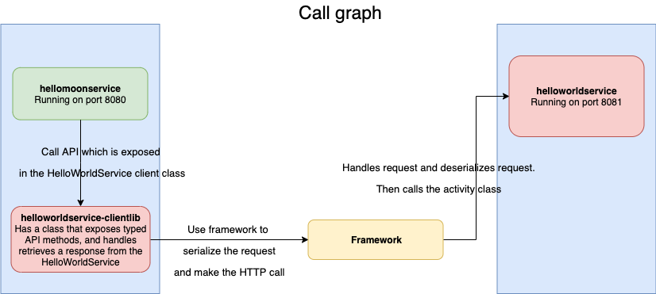
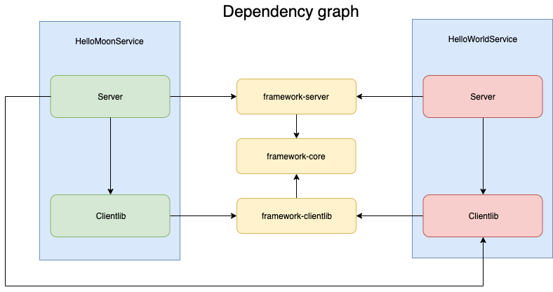

# Captain Hook

[Introduction](#introduction)  
[Project structure and responsibilities](#projectstructureandresponsibilities)  
[How to get started](#howtogetstarted)

<a name="introduction"/>

## Introduction

Captain Hook is an API framework that makes sure the client and the server use the same contract to communicate.
The server generates helper classes so clients can use that to do calls to the server without any configuration.
Because the server knows the domain model, the helper classes not only take care of calling the server but also take care of serializing/deserializing the objects so the client doesn't have to do that.

<a name="projectstructureandresponsibilities"/>

## Project structure and responsibilities

For each service we need 2 modules: a "server" and a "clientlib".
Let's see what their responsibilities are

### The server module
The server module implements all the necessary functionalities for that service.
In order to handle requests, you need to define an Activity class.

Activities are similar to Spring Controllers and simply do business logic and return a response.
An Activity only handles one type of request.
It receives a single parameter (which can be a complex object by itself) and returns a simple response (wrapped in an Observable type).

### The client module
The client module is the module that gets shared with consuming services.
This is the reason it has to be split from the service' business logic: this way it's way smaller and also we don't expose anything that consumers shouldn't know about.

The module should expose a Client class and the service's domain classes.
These classes are enough to make type-checked calls to a server without needing any configurations on the consumer side (apart from adding the clientlib as a dependency in the project).






<a name="howtogetstarted"/>

## How to get started

First define the place where you want to setup this tutorial:
```
export captainHookProject=~/workspace/captainhook-tutorial
export tut=$captainHookProject/tutorial-result
echo "export captainHookProject=$captainHookProject; export tut=$tut" > ~/.captainhookvars
. ~/.captainhookvars
echo $tut
```

Then check out the git project:
```
git clone git@github.com:arthurv89/captainhook-tutorial.git $captainHookProject
cd $captainHookProject
rm -rf $tut
mkdir -p $tut
```

If at any stage you're getting errors, try determining the diff between your project and the tutorial-results folder:
```
diff $tut $captainHookProject/tutorial-result
diff $tut/helloworldservice/pom.xml $captainHookProject/tutorial-result/helloworldservice/pom.xml
```

Now let's create our project.
It's easiest to start with the clientlib module.

### Step 1: Create a clientlib module:
In this document we are going to create a service called HelloWorldService

### Add parent in pom.xml
First, create a clientlib project and add the following parent:
```
mkdir -p $tut/helloworldservice-clientlib
nano $tut/helloworldservice-clientlib/pom.xml
```

Enter the following:
```xml
<?xml version="1.0" encoding="UTF-8"?>
<project xmlns="http://maven.apache.org/POM/4.0.0" xmlns:xsi="http://www.w3.org/2001/XMLSchema-instance"
         xsi:schemaLocation="http://maven.apache.org/POM/4.0.0 http://maven.apache.org/xsd/maven-4.0.0.xsd">
    <modelVersion>4.0.0</modelVersion>
    <artifactId>helloworldservice-clientlib</artifactId>
    <groupId>com.swipecrowd.captainhook.tutorial</groupId>
    <version>1.0-SNAPSHOT</version>
    <packaging>jar</packaging>
    <name>helloworldservice-clientlib</name>

    <parent>
        <groupId>com.swipecrowd.captainhook</groupId>
        <artifactId>framework-core-clientlib</artifactId>
        <version>0.1.0</version>
    </parent>

    <properties>
        <project.build.sourceEncoding>UTF-8</project.build.sourceEncoding>
    </properties>

    <build>
        <resources>
            <resource>
                <directory>${project.basedir}/src/main/resources</directory>
                <includes>
                    <include>**/*.properties</include>
                </includes>
            </resource>
        </resources>
    </build>
</project>

```

### Add Input and output classes

The Activity input class can be anything you want, as long as it inherits from the Input class.

In the example below, we used Lombok to add getters and a builder to generate this object in a clean way, and to get it's parameters without creating the getter methods ourselves.
```
mkdir -p $tut/helloworldservice-clientlib/src/main/java/com/swipecrowd/captainhook/tutorial/helloworldservice/activity/helloworld
nano $tut/helloworldservice-clientlib/src/main/java/com/swipecrowd/captainhook/tutorial/helloworldservice/activity/helloworld/HelloWorldInput.java
```

Edit the file with the following contents:
```java
package com.swipecrowd.captainhook.tutorial.helloworldservice.activity.helloworld;

import lombok.Builder;
import lombok.Getter;
import com.swipecrowd.captainhook.framework.server.Input;

@Builder
@Getter
public class HelloWorldInput extends Input {
    private final String name;
}
```

The Activity output class is similar to the input class: you have all the freedom define it, as long as you set it's parent class: to Output.

```
nano $tut/helloworldservice-clientlib/src/main/java/com/swipecrowd/captainhook/tutorial/helloworldservice/activity/helloworld/HelloWorldOutput.java
```

Edit the file with the following contents:
```java
package com.swipecrowd.captainhook.tutorial.helloworldservice.activity.helloworld;

import lombok.Builder;
import lombok.EqualsAndHashCode;
import lombok.Value;
import com.swipecrowd.captainhook.framework.common.response.Output;

import java.time.Instant;

@Builder
@Value
@EqualsAndHashCode(callSuper = false)
public class HelloWorldOutput extends Output {
    private String message;
    private Instant respondingTime;
}
```

Lastly, in the resources folder, create a file called application.properties and add the following lines:

```
mkdir -p $tut/helloworldservice-clientlib/src/main/resources
nano $tut/helloworldservice-clientlib/src/main/resources/application.properties
```

Edit the file with the following contents:
```
name = Hello World Service
server.port = 8080
```

With the clientlib in place, we can now move on to the server module.


### Step 2: Create a server module:

```
mkdir -p $tut/helloworldservice
nano $tut/helloworldservice/pom.xml
```

Again, after creation of the server module, let's change the pom.xml file:
```xml
<?xml version="1.0" encoding="UTF-8"?>
<project xmlns="http://maven.apache.org/POM/4.0.0" xmlns:xsi="http://www.w3.org/2001/XMLSchema-instance"
         xsi:schemaLocation="http://maven.apache.org/POM/4.0.0 http://maven.apache.org/xsd/maven-4.0.0.xsd">
    <modelVersion>4.0.0</modelVersion>
    <groupId>com.swipecrowd.captainhook.tutorial</groupId>
    <artifactId>helloworldservice</artifactId>
    <version>1.0-SNAPSHOT</version>
    <packaging>jar</packaging>
    <name>helloworldservice</name>

    <properties>
        <project.mainClass>com.swipecrowd.captainhook.tutorial.helloworldservice.ServiceMain</project.mainClass>
    </properties>

    <parent>
        <groupId>com.swipecrowd.captainhook</groupId>
        <artifactId>framework-core-server</artifactId>
        <version>0.1.0</version>
    </parent>

    <dependencies>
        <dependency>
            <groupId>${project.groupId}</groupId>
            <artifactId>${project.artifactId}-clientlib</artifactId>
            <version>${project.version}</version>
        </dependency>
    </dependencies>
</project>
```

The service can be started similarly to how you can start a Spring Boot application.
The main method of your ServiceMain class should call the run method on the Controller class.
That method starts up the service.

The parameters are a ServerProperties (which will be generated when you first build the application), followed by a list of plugins (however, this is optional).
Lastly, it will also receive an array of String arguments, which can be used to configure plugins or internals of the framework.

```
mkdir -p $tut/helloworldservice/src/main/java/com/swipecrowd/captainhook/tutorial/helloworldservice
nano $tut/helloworldservice/src/main/java/com/swipecrowd/captainhook/tutorial/helloworldservice/ServiceMain.java
```

```java
package com.swipecrowd.captainhook.tutorial.helloworldservice;

import com.swipecrowd.captainhook.tutorial.helloworldservice.server.ServerProperties;
import com.swipecrowd.captainhook.framework.server.Controller;

public class ServiceMain {
    public static void main(String[] args) {
        Controller.run(
                new ServerProperties(),
                args);
    }
}
```

Now create an activity class that handles the request.

```
mkdir -p $tut/helloworldservice/src/main/java/com/swipecrowd/captainhook/tutorial/helloworldservice/server/activity/helloworld/
nano $tut/helloworldservice/src/main/java/com/swipecrowd/captainhook/tutorial/helloworldservice/server/activity/helloworld/HelloWorldActivity.java
```

```java
package com.swipecrowd.captainhook.tutorial.helloworldservice.server.activity.helloworld;

import com.swipecrowd.captainhook.tutorial.helloworldservice.activity.helloworld.HelloWorldInput;
import com.swipecrowd.captainhook.tutorial.helloworldservice.activity.helloworld.HelloWorldOutput;
import com.swipecrowd.captainhook.framework.server.SimpleActivity;
import com.swipecrowd.captainhook.framework.server.Activity;
import org.springframework.stereotype.Component;
import rx.Observable;

import java.time.Instant;

@Activity
@Component
public class HelloWorldActivity extends SimpleActivity<HelloWorldInput, HelloWorldOutput> {
    @Override
    public Observable<HelloWorldOutput> enact(HelloWorldInput helloWorldInput) {
        final HelloWorldOutput output = HelloWorldOutput.builder()
                .message(String.format("HelloMoonService received HelloWorldInput with name property: \"%s\"", helloWorldInput.getName()))
                .respondingTime(Instant.now())
                .build();

        return Observable.just(output);
    }
}
```

### Step 4: Build & run the application
To generate the classes that are necessary, you should simply run in both projects:
```
cd $tut/helloworldservice-clientlib && \
mvn clean compile install && \
cd $tut/helloworldservice && \
mvn clean compile install
```

To run the service, run:
```
cd $tut/helloworldservice
mvn -Prun exec:java
```

Now you have a running service!
When you go to http://localhost:8080/ , it should say: "The server is online!".
When you go to http://localhost:8080/activity?activity=HelloWorld&encoding=JSON&payload=%7B%22name%22%3A%22Captain%20Hook%22%7D, it will show the response from the server.

Other services can can now consume it's clientlib and call it without much effort.
If those other services also implement the same model, their consumers can also easily call them.
Let's do that!

### Step 5: Create a second Captain Hook service: HelloMoonService
In this last step we're going to make a service called HelloMoonService that calls the HelloWorldService that we have created previously.

Open a new tab and execute the following script to create the HelloMoonService:
```
. ~/.captainhookvars
bash -e $captainHookProject/tutorial-scripts/cloneAndReplace.sh
```

Both services are now in place. They are configured to run on different ports: HelloWorldService runs on port 8080 and HelloMoonService runs on port 8081.
However, before we run it, let's configure the HelloMoonService to call HelloWorldService.

Add the following dependency to HelloMoonService's pom.xml
```
nano $tut/hellomoonservice/pom.xml
```

```xml
<dependencies>
    [...]
    <dependency>
        <groupId>com.swipecrowd.captainhook.tutorial</groupId>
        <artifactId>helloworldservice-clientlib</artifactId>
        <version>1.0-SNAPSHOT</version>
    </dependency>
    [...]
</dependencies>
```

Now simply change the enact method in HelloMoonActivity to call the Client class that the HelloWorldService Clientlib exposed:

```
nano $tut/hellomoonservice/src/main/java/com/swipecrowd/captainhook/tutorial/hellomoonservice/server/activity/hellomoon/HelloMoonActivity.java
```

```
[...]
import com.swipecrowd.captainhook.tutorial.helloworldservice.activity.helloworld.HelloWorldInput;
import com.swipecrowd.captainhook.tutorial.helloworldservice.client.Client;
[...]

@Activity
@Component
public class HelloMoonActivity extends SimpleActivity<HelloMoonInput, HelloMoonOutput> {
    @Override
    public Observable<HelloMoonOutput> enact(HelloMoonInput helloMoonInput) {
        final HelloWorldInput helloWorldInput = HelloWorldInput.builder().name(helloMoonInput.getName()).build();
        return new Client().helloWorldCall(helloWorldInput)
                .map(response -> HelloMoonOutput.builder()
                        .message(String.format("HelloMoonService received response from HelloWorldService: \"%s\"", response.getMessage()))
                        .respondingTime(Instant.now())
                        .build());
    }
}
```

After build the HelloMoon projects...
```
cd $tut/hellomoonservice-clientlib
mvn clean compile install
cd $tut/hellomoonservice
mvn clean compile install
```

... we will be able to run the HelloMoonService
```
cd $tut/helloMoonService
mvn -Prun exec:java
```

When you go to http://localhost:8081/activity?activity=HelloMoon&encoding=JSON&payload=%7B%22name%22%3A%22Captain%20Hook%22%7D, it will show the response from the HelloMoonService which shows that inside it has called the HelloWorldService.
